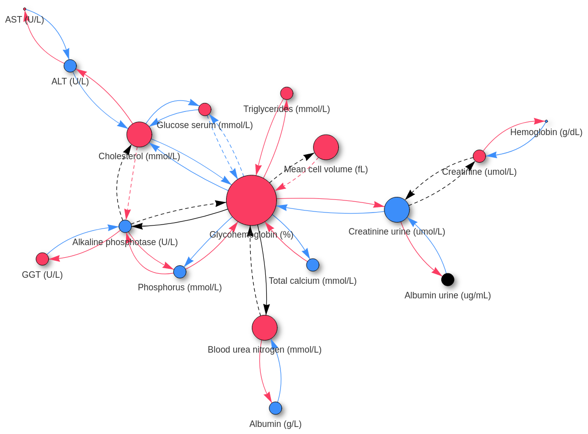

# README

This package allows you to create a comprehensive visualization graph of feature interactions for machine learning models explained with Local Additive Explanation methods. It should work with any 3-dimensional array of explanation interactions but is particularly well suited for the output of the `TreeExplainer` SHAP interaction extractor from the *shap* Python library.

### Get started

Download this repository or clone it, then navigate to the root directory where *setup.py* should be. Then run:

```bash
pip install .
```

You should be ready to go. You can now import `ShapInteractions` from `shapinteractions` and use it in your Python environment and scripts:

```python
from shapinteractions import ShapInteractions
```


### How to use the package?

You'll find an [example_notebook.ipynb](examples/example_notebook.ipynb) where everything is explained.

### How to read the graph?

You can open the [examples/example_graph.html](examples/example_graph.html) directly in a web browser to interact with it.



Each **feature** is represented by a **node**:
- its color informs about whether the feature is positively correlated (red) or negatively correlated (blue) with the model predictions
- its size relates to the average absolute SHAP value of the feature's main effect (the contribution of the feature alone, without accounting for its interactions)

Each **interaction** is represented by an **arrow**:
- its color informs about whether the interaction reinforces (red) or attenuates (blue) the main effect of the pointed feature (regardless of that feature's color)
- the top slider allows you to hide/reveal interactions based on their strength (average absolute SHAP interaction value)

A node/arrow is rendered black if its Spearman's and Pearson's coefficients are of opposite signs, suggesting that the relationship is more complex than it appears. Similarly, if Spearman's coefficient for a given interaction is smaller than `spearmans_threshold` (default value of 0.3), the arrow is rendered dashed, suggesting that the correlation is weak.

You can hover over a node/arrow to display the corresponding correlation coefficients and average absolute SHAP value.

